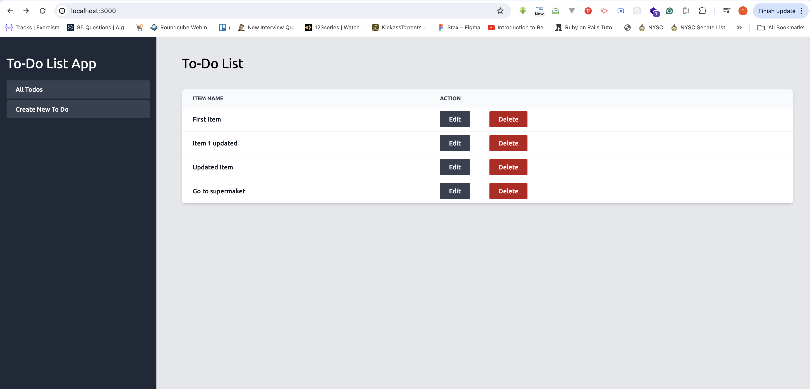
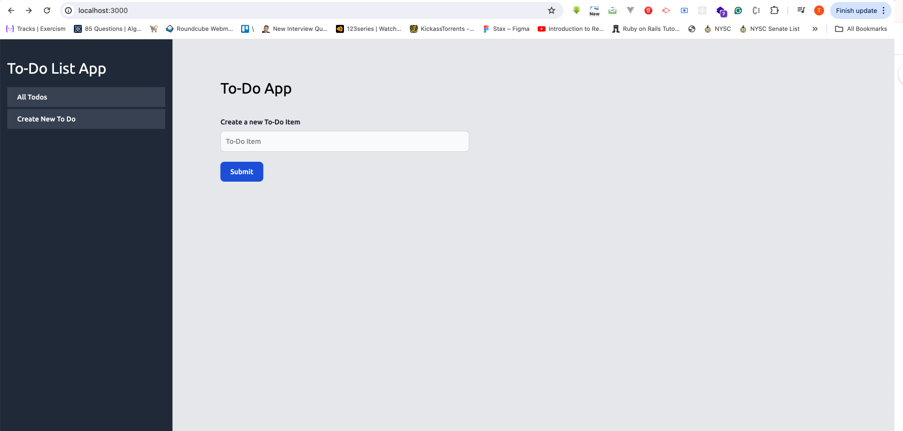

# README

This README would normally document whatever steps are necessary to get the
application up and running.

Things you may want to cover:

* Ruby version

  Ruby 3.2.2

* System dependencies
  Start the application with `bin/dev`

* Configuration
  The project uses stimulus, hotwired turbo, tailwind, and definitely Ruby on Rails

* Database
  The database used is sqlite3 which will automatically be created once you run your migration
  rails:db migrate

* How to run the test suite

  run the command `rspec` to run the test suite

* ...
